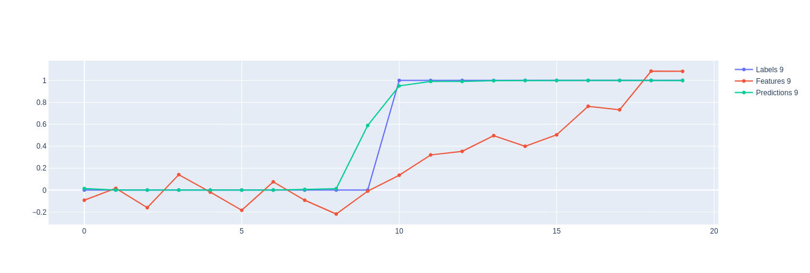

# ptcn

Tensorflow (2.x) implementation of a Temporal Convolutional Network architecture, with a probabilistic twist.

This project indulges a couple of curiosities:

1. Working with convolutional sequence-to-sequence models a la [An Empirical Evaluation of Generic Convolutional and Recurrent Networks for Sequence Modeling](https://arxiv.org/abs/1803.01271)
2. Adding a bayesian twist to the network a la [Bayesian Segnet: Model Uncertainty in Deep Convolutional Encoder-Decoder Architectures for Scene Understanding](https://arxiv.org/abs/1511.02680)

This implementation has been inspired by other projects, including:
- https://github.com/locuslab/TCN
- https://github.com/Baichenjia/Tensorflow-TCN
- https://github.com/philipperemy/keras-tcn

## Usage

### Detecting events as shifts between regimes

Sometimes I find myself working on problems where a variable is expected to shift from one regime to another at a point in time, and we want to detect when that shift happened. If we're working with noisy data, detecting that event with confidence can be tricky.

Sequence-to-sequence learning, and TCNs in particular, allow us to produce labels for each time step whilst taking multiple time-steps into account when labelling each individual time step. What's really powerful about using a convolutional architecture is that we can train one model, but then apply it to time series of varying lengths at inference time.

In this example, we'll create some synthetic data to describe this type of problem, and then look at the TCN's ability to detect the occurrence of the regime-switch.


```python
import ptcn
import plotly.graph_objects as go
import numpy as np
import tensorflow as tf
```

### Create a synthetic dataset

The objective in this exercise is to demonstrate the ability for the ptcn to learn coherent classification labels for each element of a sequence.

In this example, I am particularly interested in estimating labels for sequences that demonstrate a path-dependent state transition; ie. the labels of later elements depend on what has gone before, not just the feature values at that timestamp.

I create this path dependence by creating sequences whose labels pass from an initial phase in which all elements belong to the first category (labelled as 0), and a second phase in which all elements belong to the second category (labelled as 1). Each sample varies according to where in the sequence the transition from phase 1 to phase 2 occurs, so our model cannot learn to blindly predict that the transition occurs at the same point in each sequence.

**Config**

To begin with, we'll specify some of the properties of our dataset.

`SEQUENCE_LENGTH` defines the number of time steps to include in each sequence

`N_FEATURES` defines the number of dimensionality of the input variables

`N_EXAMPLES` defines the number of examples to be created in the synthetic dataset


```python
SEQUENCE_LENGTH = 20
N_FEATURES = 1
N_EXAMPLES = 10000
```

### Randomly sample transition points

We begin by randomly sampling the index position in each example at which the transition from phase 1 to phase 2 will occur. We'll use this to generate appropriate feature & target values.

The `low` & `high` args set a boundary on where in the sequence these transitions are permitted to occur (we choose the constrain the transitions to occur between the 5th & the 15th index position).


```python
transition_indices = np.random.uniform(low=5., high=16., size=N_EXAMPLES).astype(np.int)
```

### Generate classification labels

We use these 'transition indices' to generate the classification labels for our dataset.

The results in an array with dimensions: (N_EXAMPLES, SEQUENCE_LENGTH, N_FEATURES)


```python
def generate_labels(t_idx, sequence_len):
    zeros = np.zeros(t_idx)
    ones = np.ones(sequence_len - t_idx)
    return np.expand_dims(np.concatenate((zeros, ones), axis=0), axis=1)
```


```python
labels = np.array([generate_labels(t_idx, SEQUENCE_LENGTH) for t_idx in transition_indices])
print(labels.shape)

>>     (10000, 20, 1)
```


### Generate feature values

In order to create features that can be used to predict these labels, we duplicate the labels and add some random jitter to them.

```python
jitter = 0.1 * np.random.randn(N_EXAMPLES, SEQUENCE_LENGTH, N_FEATURES)
```

```python
def generate_relu_features(t_idx, sequence_len):
    zeros = np.zeros(t_idx)
    # We have to round because the floats are otherwise not exactly divisible by 0.1 and we get inconsistent sequence lengths
    ones = np.ones(sequence_len - t_idx) * np.arange(0.1, round(0.1 * (1 + sequence_len - t_idx), 2), 0.1)
    return np.expand_dims(np.concatenate((zeros, ones), axis=0), axis=1)

relu_features = np.array([generate_relu_features(t_idx, SEQUENCE_LENGTH) for t_idx in transition_indices])
relu_features.shape

>>     (10000, 20, 1)
```


```python
features = relu_features + jitter
```

This is what our features look like:


### Split the data into training & test

```python
dataset = tf.data.Dataset.from_tensor_slices((features, labels))
BATCH_SIZE = 256
BUFFER_SIZE = 10000
dataset = dataset.cache().shuffle(BUFFER_SIZE).batch(BATCH_SIZE).repeat()
```

## Initialise & train the TCN


```python
from ptcn.networks import GenericTemporalConvNet
```


```python
tcn = GenericTemporalConvNet(n_filters=(10, 20, 50, 10, 1), problem_type='classification')
```


```python
loss = tf.keras.losses.BinaryCrossentropy(
    from_logits=False, label_smoothing=0.,
    name='binary_crossentropy'
)
```


```python
tcn.compile(optimizer=tf.keras.optimizers.RMSprop(), loss=loss)
```


```python
tcn.fit(dataset, epochs=60, steps_per_epoch=40)
```

```python
    Epoch 1/60
    WARNING:tensorflow:Layer generic_temporal_conv_net is casting an input tensor from dtype float64 to the layer's dtype of float32, which is new behavior in TensorFlow 2.  The layer has dtype float32 because it's dtype defaults to floatx.
    
    If you intended to run this layer in float32, you can safely ignore this warning. If in doubt, this warning is likely only an issue if you are porting a TensorFlow 1.X model to TensorFlow 2.
    
    To change all layers to have dtype float64 by default, call `tf.keras.backend.set_floatx('float64')`. To change just this layer, pass dtype='float64' to the layer constructor. If you are the author of this layer, you can disable autocasting by passing autocast=False to the base Layer constructor.
    
    40/40 [==============================] - 1s 35ms/step - loss: 0.7756
    Epoch 2/60
    40/40 [==============================] - 1s 35ms/step - loss: 0.7546
    ... ... ...
    Epoch 59/60
    40/40 [==============================] - 1s 36ms/step - loss: 0.1691
    Epoch 60/60
    40/40 [==============================] - 1s 34ms/step - loss: 0.1693
```


## Evaluation

First, we run the model on all the input data with `training=False` (default value) which means we do not apply dropout
 during inference, and therefore yield a deterministic set of results.

```python
predictions = tcn(features)
```

Then we run the model with `training=True` so as to apply dropout and thereby sample different model realisations with
 each run.

```python
p_predictions_1 = tcn(features, training=True)
```

We run this a second time to demonstrate that - in this case - the results are not deterministic.

```python
p_predictions_2 = tcn(features, training=True)
```

And then we visualise the results.


## Training with non-causal conv


```python
tcn2 = GenericTemporalConvNet(n_filters=(10, 20, 50, 10, 1), padding_type="same", problem_type='classification')
```


```python
tcn2.compile(optimizer=tf.keras.optimizers.RMSprop(), loss=loss)
```


```python
tcn2.fit(dataset, epochs=60, steps_per_epoch=40)
```

```python
    Epoch 1/60
    40/40 [==============================] - 2s 38ms/step - loss: 0.6573
    Epoch 2/60
    40/40 [==============================] - 2s 38ms/step - loss: 0.4354
    ... ... ...
    Epoch 59/60
    40/40 [==============================] - 1s 35ms/step - loss: 0.0992
    Epoch 60/60
    40/40 [==============================] - 1s 33ms/step - loss: 0.1011
``````

```python
predictions2 = tcn2(features)
```





## Probabilistic interpretation

For each input, duplicate x 15 & run inference in training mode so we sample from different weights each time

Take mean of estimates for each timestamp for point estimate
Take st. dev. of estimates for each timestamp for confidence in each point estimate

Plot mean & confidence interval


